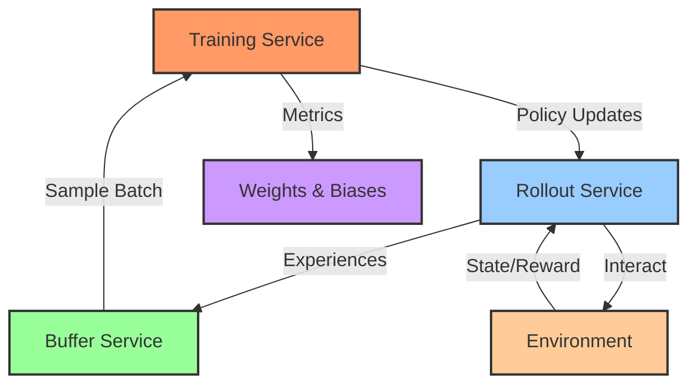

# TITAN-RL

<h4 align="center">
    <p>
        <b>English</b> |
        <a href="./README_ZH.md">中文</a>
    <p>
</h4>

This project is inspired by the groundbreaking work of [Kimi k1.5: Scaling Reinforcement Learning with LLMs](https://arxiv.org/html/2501.12599v1).

TITAN-RL is a distributed reinforcement learning framework that separates policy rollout, experience storage, and training into independent microservices. This design enables flexible scaling and efficient resource utilization.

## Architecture



The system consists of three main components:

1. **Rollout Service**: Handles environment interactions and experience collection
   - Multiple workers can run in parallel
   - Implements epsilon-greedy exploration
   - Computes trajectory-level statistics

2. **Buffer Service**: Manages experience replay storage
   - Thread-safe experience storage
   - Efficient batch sampling
   - Configurable buffer size

3. **Training Service**: Coordinates the training process
   - Implements DQN algorithm
   - Manages policy updates
   - Tracks training metrics via wandb

The components communicate via gRPC, allowing for distributed deployment and easy scaling.

## Features

- Distributed architecture with gRPC communication
- Modular design for easy algorithm implementation
- Built-in support for Weights & Biases logging
- Configurable via YAML files
- Visualization tools for trained agents
- Multi-threaded experience collection and training

## Installation

```bash
# Clone the repository
git clone https://github.com/yourusername/titan-rl.git
cd titan-rl

# Install dependencies
pip install -r requirements.txt

# Generate protobuf code
bash generate_proto.sh
```

## Usage

1. Start the services:
```bash
bash run.sh
```

This will:
- Launch the rollout server
- Start the buffer server
- Begin the main training loop

2. Monitor training:
- Visit your Weights & Biases dashboard to view training metrics
- Check terminal output for episode rewards and training status

3. Visualize trained agent:
```bash
python visualize.py --model_path checkpoint.pth
```

## Configuration

The system is configured via YAML files in the `config` directory. Example configuration:

```yaml
rollout_server:
  num_workers: 1
  env_name: "CartPole-v1"
  epsilon: 0.1

policy:
  path: "models.simple_policy.SimplePolicy"
  kwargs:
    state_dim: 4
    action_dim: 2

train:
  lr: 0.001
  gamma: 0.99
  batch_size: 64
  min_buffer_size: 1000
```

## Extending the Framework

1. **Adding New Algorithms**:
   - Create a new trainer class in `trainers/`
   - Implement the required interface methods
   - Update configuration to use the new trainer

2. **Custom Environments**:
   - TITAN-RL supports any Gymnasium-compatible environment
   - Update the environment name in configuration

3. **Custom Policies**:
   - Add new policy classes in `models/`
   - Implement the required PyTorch interface

## Contributing

Contributions are welcome! Please feel free to submit a Pull Request.

## License

This project is licensed under the MIT License - see the [LICENSE](LICENSE) file for details.

## Acknowledgments

- Built with PyTorch and Gymnasium
- Monitoring with Weights & Biases
- Distributed communication via gRPC
