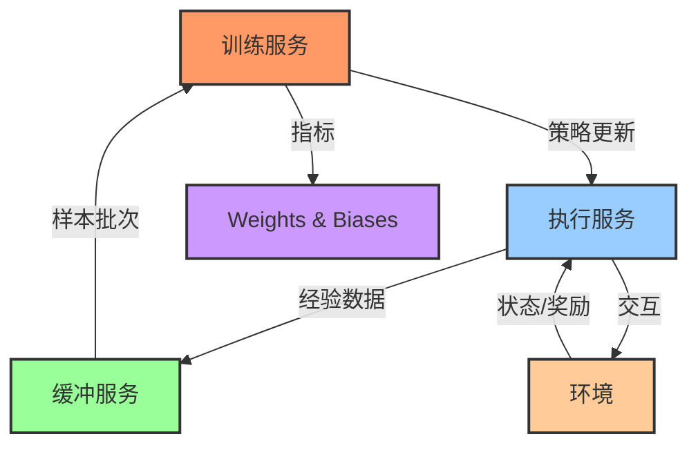

# TITAN-RL

<h4 align="center">
    <p>
        <b>中文</b> |
        <a href="./README.md">English</a>
    <p>
</h4>

TITAN-RL 是一个分布式强化学习框架，它将策略执行、经验存储和训练分离为独立的微服务。这种设计实现了灵活的扩展和高效的资源利用。

## 架构



系统由三个主要组件构成：

1. **执行服务**：处理环境交互和经验收集
   - 支持多个工作器并行运行
   - 实现 epsilon-贪婪探索
   - 计算轨迹级别的统计数据

2. **缓冲服务**：管理经验回放存储
   - 线程安全的经验存储
   - 高效的批次采样
   - 可配置的缓冲区大小

3. **训练服务**：协调训练过程
   - 实现 DQN 算法
   - 管理策略更新
   - 通过 wandb 跟踪训练指标

组件之间通过 gRPC 通信，支持分布式部署和便捷扩展。

## 特性

- 基于 gRPC 通信的分布式架构
- 模块化设计便于算法实现
- 内置支持 Weights & Biases 日志记录
- 通过 YAML 文件配置
- 训练智能体的可视化工具
- 多线程经验收集和训练

## 安装

```bash
# 克隆仓库
git clone https://github.com/yourusername/titan-rl.git
cd titan-rl

# 安装依赖
pip install -r requirements.txt

# 生成 protobuf 代码
bash generate_proto.sh
```

## 使用方法

1. 启动服务：
```bash
bash run.sh
```

这将：
- 启动执行服务器
- 启动缓冲服务器
- 开始主训练循环

2. 监控训练：
- 访问 Weights & Biases 仪表板查看训练指标
- 查看终端输出的回合奖励和训练状态

3. 可视化训练后的智能体：
```bash
python visualize.py --model_path checkpoint.pth
```

## 配置

系统通过 `config` 目录中的 YAML 文件进行配置。配置示例：

```yaml
rollout_server:
  num_workers: 1
  env_name: "CartPole-v1"
  epsilon: 0.1

policy:
  path: "models.simple_policy.SimplePolicy"
  kwargs:
    state_dim: 4
    action_dim: 2

train:
  lr: 0.001
  gamma: 0.99
  batch_size: 64
  min_buffer_size: 1000
```

## 扩展框架

1. **添加新算法**：
   - 在 `trainers/` 中创建新的训练器类
   - 实现所需的接口方法
   - 更新配置以使用新训练器

2. **自定义环境**：
   - TITAN-RL 支持任何兼容 Gymnasium 的环境
   - 在配置中更新环境名称

3. **自定义策略**：
   - 在 `models/` 中添加新的策略类
   - 实现所需的 PyTorch 接口

## 贡献

欢迎贡献！请随时提交 Pull Request。

## 许可证

本项目采用 MIT 许可证 - 详见 [LICENSE](LICENSE) 文件。

## 致谢

- 基于 PyTorch 和 Gymnasium 构建
- 使用 Weights & Biases 进行监控
- 通过 gRPC 实现分布式通信
